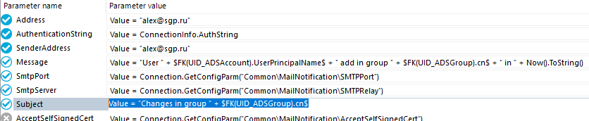
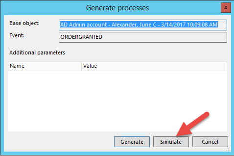
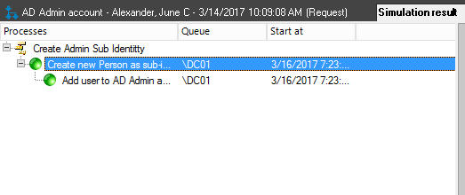
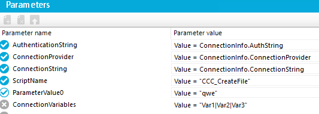
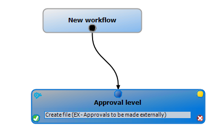
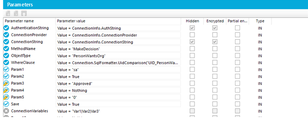
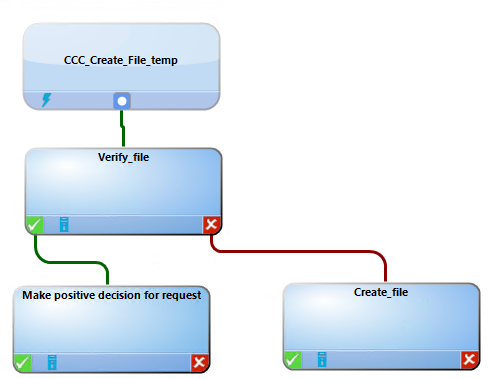
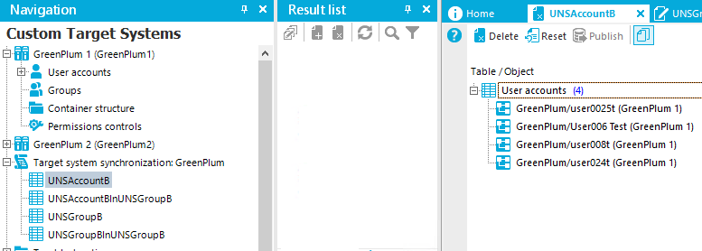

1\. Misc

16 августа 2019 г.

18:34

 


 

 

 


 

 


 

Уникальность имени аккаунта

 


 

 

Mapping


# Почитать

> <https://slourc.wordpress.com/2015/03/01/d1im-designer-deleguer-automatiquement-les-droits-de-responsable-sur-une-personne-a-un-assistant/>
>
> 
>
> <https://support.oneidentity.com/technical-documents/identity-manager/8.0/configuration-guide/73>
>
> 
>
> [Identity Manager 8.0.1 - Target System Synchronization Reference
> Guide
> (oneidentity.com)](https://support.oneidentity.com/technical-documents/identity-manager/8.0.1/target-system-synchronization-reference-guide/6)
>
> 
>
> [OneIdentity/IdentityManager.PoSh-Connector-Generator
> (github.com)](https://github.com/OneIdentity/IdentityManager.PoSh-Connector-Generator)
>
> 
>
**SQL Server Collation** SQL_Latin1_General_CP1_CI_AS
>
> 
>
> Почта
>
> Postfix на WSL
>
> Порт 2526
>
> 
>
> **Реконсиляция: **Процесс приведения в соответствие данных,
> находящихся в системе IDM, с данными, представленными в целевых
> системах. В рамках согласования осуществляется корреляция данных,
> выявление существующих различий, а также инициируется внесение
> необходимых изменений.
>
> 
>
> *From
> \<<http://co-inform.ru/solutions/identity-and-access-management/glossary.php>\>*
>
> 
>
> 
>
> 
>
> ВАЖНО! При создании скриптов - если будут использоваться доп функции -
> прописывать импорт модулей в каждом скрипте!
>
> 
>
> Job Server должен быть SQL Processing Server
>
> Очередь меняем и в дизайнере и в конфиге сервиса на самом Job Server
>
> Чтобы JobServer появился в просмотре очереди - надо его
> сконфигурировать, через конфигуратор (можно выбрать Template из
> главного меню)
>
> ~~Если БД, с которой работает JobServer находится на другом сервере -
> надо в настройках JobServer указать Execution Server на сервер с БД~~
>
> 
>
> 
>
> 3\) Для портала пользователя создаем в Manager и указываем System User
> Password!
>
> 
>
> 4\) Чтобы узнать, в какую таблицу загружать данные - в Manager –
> открыть Employee - View – Show Field Definition
>
> 
>
> 
>
> **---------------------------------------------------------------**
>
> 
>
> # **1) Password Policy**
>
> 
>
> Если Initial Password оставить пустым - система булдет генерить
> произвольный пароль!
>
> 
>
> **Сцепление**
>
> **Manager – Domain – Define search criteria for employee assignment**
>
> PERSONNELNUMBER = EMPLOYEE UID (см скриншот справа)
>
> 
>
> # **2) Account Definition** нужен для того, чтобы управлять целевой
>
> системой.
>
> Пока он не определен - управление работать не будет.
>
> Можно задать двумя способами

- На домен

- На аккаунт

> Manager – Employees – Active Directory - Basic Conf Data - Account
> Definitions
>
> 
>
> **Full Managed** means that all predefined attributes are affected and
> **Unmanaged** means that only mandatory predefined attributes are
> affected.
>
> 
>
> **IT Operating Data -** указывает связи между департаментом в базе и
> AD.
>
> Выбрать департамент - Tasks – Edit It operating Data
>
> 
>
> **После создания пользователя в БД, чтобы он создался в AD надо правой
> кнопкой по нему - Tasks – Assign Account Definitions**
>
> 
>
> 
>
> **Связь департаментов в базе и OU в AD**
>
> Делаем выгрузку в csv на основании запроса.
>
> Затем делает Data Import этой csv в БД, чтобы корректно заполнить
> таблицу TSBITData.
>
> 
>```
>> select newid() as uid_TSBITData, Department.UID_Department as
> UID_ORG,'\<Key\>\<T\>TSBAccountDef\</T\>\<P\>8b826aeb-9a5f-4c84-a528-6af40976b6f7\</P\>\</Key\>'
> as ObjectKeyAppliesTo, 'ADS-D7251336DB99478B8616695F0DF66584' as
> UID_DialogColumnTarget, ADSContainer.UID_ADSContainer, 'TSBAccountDef:
> Std. user account Domain SGP - ADSAccount.UID_ADSContainer' as
> DisplayValue from Department INNER JOIN ADSContainer ON
> Department.Commentary=ADSContainer.DistinguishedName
>```
>
> **После импорта csv надо проверить, что в базе Department и TSBITDATA
> одинаковое кол-во департаментов и связей! Иначе, надо вручную
> добавлять связи!**
>
> 
>
> 
>
> # 3) Создание Person в БД (Designer - Table – Person - CentralAccount)
>```
>'$CustomProperty01$
>
> If CStr($ImportSource$) \<\> "ADS" And CStr($Lastname$) \<\> ""
> And CStr($Firstname$) \<\> "" And CStr($Middlename$) \<\> "" And _
>
> (Not CBool(Connection.Variables.Get("FULLSYNC")) Or
> CStr($ImportSource$).StartsWith("EBS") Or
> CStr($ImportSource$).StartsWith("SAP") ) Then
>
> If
> CStr(Connection.GetConfigParm("QER\Person\CentralAccountGlobalUnique"))="1"
> Then
>
> Value = CCC_AE_BuildCentralAccountGlobalUnique(
> GetValue("UID_Person").String, $Lastname$, $Firstname$,
> $Middlename$)
>
> Else
>
> Value = CCC_AE_BuildCentralAccount( GetValue("UID_Person").String,
> $Lastname$, $Firstname$, $Middlename$)
>
> End If
>
> End If
>```
> 
>
> **Чтобы при создании пользователя в AD корректно прописывался cn, Full
> name …**
>
> Надо для cn прописать
>```
>> If $Givenname$ \<\> $Givenname\[o\]$ Or $Surname$ \<\>
> $Surname\[o\]$ Or **$FK(UID_Person).Middlename$** \<\>
> $FK(UID_Person).Middlename\[o\]$ Then
>
> If $Givenname$\<\>"" AndAlso $Surname$\<\>"" AndAlso
> $FK(UID_Person).Middlename$\<\>"" Then
>
> CN = $Surname$ & " " & $Givenname$ & " " &
> **$FK(UID_Person).Middlename$**
>```

>
> 
>
> # **4) Роли классов**
>
> Можно создавать много деревьев ролей.
>
> Каждому дереву ролей нужен корневой элемент, который называется ролью
> класса (role class).
>
> Эта роль класса используется для определения назначаемых ресурсов и
> наследование ресурсов в этом дереве.
>
> Если испортить наследование - это будет невозможно изменить. Чтобы
> пофиксить, надо удалить роль класса и пересоздать ее. Надо быть
> внимательным при создании роли класса.
>
> В порядке назначения объектов ролевой структуре, нужно настроить эту
> функцию для каждого класса объекта для управления.
>
> 
>
> Роли позволяют создать связь Account Definitions и условие отбора
> пользователя в целевой системе.
>
> Например, мы можем применять политику по созданию учетной записи
> только для пользователей в определенном подразделении (через
> назначение Dynamic role).
>
> Создаем Account definition для AD, например -\> Класс роль -\> Бизнесс
> роль -\> Назначаем роли Dynamic role (если находится в определенном
> подразделении - создавать аккаунт в AD, например).
>
> На пользователя можно назначить Бизнесс роль вручную.
>
> 

| **Show Entitlement origin - позволяет показать, что привязано к сотруднику.** |
|----|

> У роли можно отключить наследование - это важно делать, чтобы не было
> оч много задач!
>
> -----
>
>  
>
> # **5) Compliance rule**
>
> Для того, чтобы предотвратить нахождение одного пользователя в двух
> ролях.
>
>  
>
> Preventative Compliance check
>
>  
>
> Identity Audit - \> Rules.
>
>  
>
> Чтобы отредактировать правило - надо редактировать его рабочую копию.
>
> Также недостаточно нажать \[Сохранить\], чтобы активировать изменения.
> После
>
> сохраняя, нажмите Включить рабочую копию в списке задач, чтобы
> активировать ее.
>
>  
>
> Preventative Compliance checks лучше, так как не позволяют саму
> возможность добавления пользователей в группы одновременно. **Работают
> как часть approval policy. Без нее - не будет работать!**
>
>  
>
>  style="width:4.3125in;height:3.20833in"
> alt="АЦК “муниципальнмй заказ“ Менеджер Approve policy ApprovaI IeveI Се три апсе Approval leve&#39; дрргауе Мападег (СМ •Recipiev-,V&#39; " />
>
>  
>
>  
>
> **------**
>
> # **6) По Account Definitions для HP Service Desk**
>
> Пользователь прилетает из CSV
>
> На основании подразделения он помещается в нужную Бизнес роль
> автоматически (dynamic role).
>
> На эту бизнес роль назначен Account Definition из AD и из HP Service
> desk, который создает пользователя в AD и в HP и добавляет
> пользователя в нужные группы AD и роли Service desk.
>
>  
>
> Acc Def HP Employee Account Def требует Std User Account Domain SGP
> (отключил, чтобы можно было оставить при временном отключении
> пользователя)
>
> HP Account Def требует Acc Def HP Employee Account Def
>
>  
>
> # **7) System Debugger**
>
> Создаем скрипт в Designer, и открываем его в Visual Studio и правим.
>
> Надо открывать проект "C:\Program Files\One Identity\One Identity
> Manager\SystemLibrary\SystemLibrary.sln" через Visual Studio
>
> Потом запускаем его и открывается System Debugger!
>
> 19\) Риск
>
> Если пользователь имеет несколько аккаунтов в разных системах - у него
> будет выше риск
>
>  
>
> 20\) Job Server - это ОС с Job Service
>
> In Win is One Identity Manager Job Service (short name:
> OneIMService)  
>  
># **8) Временное отключение пользователя**
> 
><https://support.oneidentity.com/technical-documents/identity-manager/8.0/target-system-base-module-administration-guide/5>
> 
>
>  
>Срабатывает расписание (Designer - Base Data – Schedules)
> 
>"Lock accounts of employees that have left the company"
> 
>
>  
>Для разблокировки расписание
> 
>"Enable temporarily disabled accounts"
> 
>
>  
>Для внешних систем надо обрабатывать события Enabled и Disabled, как
> отдельные процессы с отдельными скриптами.
> 
>
>  
># **9) External Employee**
> 
>Можно создать для них ITSHOP с условием - External и накинуть
> политику - утверждения / аттестации для них.
> 
>*Или сделать Бизнес роль с динамическим включением в нее и накинуть
> политику аттестации!!!*
> 
>
>  
>Роль External user approvers – в нее нужно добавить пользователя для
> аттестации External users
> 
>QER\WebPortal\PasswordResetURL - прописать адрес портала для сброса
> пароля.
> 
>
>  
># **10) Отслеживание изменений в целевой системе**
> 
>Отчет System entitlement drifts in all target systems
> 
>Через Insert в таблицу сделать процесс свой
> 
>Можно, через параметры передавать информацию прямо в скрипты
> 
>Value = $FK(UID_ADSAccount).UserPrincipalName$
> 
>
>  
>Можно сделать процесс по отправке email
> 
>Message:
> 
>Value = "User " + $FK(UID_ADSAccount).UserPrincipalName$ + " add in
> group " + $FK(UID_ADSGroup).cn$ + " in " + Now().ToString()
> 
>Subject
> 
>Value = "Changes in group " + $FK(UID_ADSGroup).cn$
> 
> style="width:6.61458in;height:1.36458in"
> alt="Parameter name Address Authenticationstring SenderAddress Message SmtpPort SmtpServer Subject Parameter value Value = •[redacted-email]• Value = Connectionlnfo.AuthString Value = •[redacted-email]• Value = •user * * • add in group Value = Connection. Value = Connection. GetCo in * NowO.ToStringO &#39;Chan ±sin rou SFKiU10 " />
> 
>
>  
><https://support.oneidentity.com/technical-documents/identity-manager/8.0/configuration-guide/73>
> 
>
>  
>
>  
>**Решение вопроса с отменой изменений членства групп в AD:**
> 
>1\) Делаем процесс на событие INSERT в таблицу ADSAccountInADSGroup
> 
>2\) Первый шаг - отправка email
> 
>3\) Скрипт, который будет удалять запись о членстве из таблицы
> ADSAccountInADSGroup (см справа)
> 
>Этот скрипт будет работать для записей с пометкой Synchronization, для
> других - не удаляет
> 
>
>  
>
>  
># **11) System roles**
> 
>Предназначены для того, чтобы можно было навесить множество ролей на
> них.
> 
>
>  
># **12) Risk Index**
> 
>Нужен для того, чтобы для добавления в определенную целевую систему
> потребовалась дополнительная аттестация, например.
> 
>***To enable the schedule for calculating risk indexes***

- Open the Designer.

- Select **Base Data \| General \| Schedules**.

- Select the schedule "Calculate risk indexes" in the List Editor.

- Check the box in the **Enabled** column.

- Save the changes.

> <https://support.oneidentity.com/technical-documents/identity-manager/8.0/risk-assessment-administration-guide/5#TOPIC-863144>
>
>  
>
> # **13) Time Trace**
>
> Отображение изменений с учетной записью
>
> Надо в дизайнере - Config Parameters – Common – ProcessState –
> PropertyLog (x) – AllDefaultPropertiesForModel (x)
>
> Затем, в менеджере - View – Time Trace (и в окне TimeTrace нажать на
> часы)
>
>  
>
> За исторические данные отвечают таблицы **DialogWatchProperty** и
> **DialogWatchOperation**
>
>  
>
>  
>
> # **14) API**
>
> <https://support.oneidentity.com/technical-documents/identity-manager/8.0/rest-api-reference-guide/15>
>
>  
>
> <https://t-oneim-4.domain/AppServer/api/entity/Department/30002471>
>
>  
>
> # **15) Формирование ФИО в Sync Editor в атрибутах**
>
> Dim probel as String = " "
>
> Dim fio as String = $LASTNAME$ & probel & $FIRSTNAME$ & probel &
> $MIDDLENAME$
>
> return fio
>
>  
>
> # **16) Active Directory - как можно сцепить учетки и пользователей**
>
> По ФИО
>
> При импорте из csv скриптом формируем ФИО в кастомный атрибут
>
> В Менеджере критерий для сцепления учеток пишем - кастомный атрибут -
> DisplayName (или Name, если лучше соответствует)
>
>  
>
> # **17) isGroupAccount**
>
> Ставится, чтобы была возможность добавлять пользователя в группы
>
> Например, у пользователя несколько учеток (администратора, обычная).
>
> Когда ему дается доступ к интернету, обе учетки будут добавляться в
> группу, а админская не должна добавляться в группу
>
>  
>
> # **18) Увольнение.**
>
> Leaving Date - блокирует учётку и удаляет ее в AD
>
> Last working day - ~~удаляет учетку (чтобы у него был доступ до
> опреденного времени в компании)~~
>
> ~~Не влияет, для информации~~
>
> Учетки переносятся в IDM в InactiveEmployee
>
> <https://www.oneidentity.com/community/identity-manager/f/forum/6822/permanently-disabling-users>
>
>  
>
> 38\) Формат даты в строку
>
> Public Sub CCC_Test3()
>
> Dim date1 = "20/02/1987"
>
> Dim date2 As DateTime = CType(DateTime.ParseExact(date1, "dd/MM/yyyy",
> System.Globalization.CultureInfo.InvariantCulture), DateTime)
>
> **Dim date3 As String = date2.ToString("dd-MM-yyyy")**
>
> MsgBox(date3)
>
> End Sub
>
>  
>
> # **19) Просмотр доступных событий для таблицы**
>
>  
>
>  style="width:6.52083in;height:3.34375in"
> alt="Object Browser - Administrator, AD @ dcC1 (Vain Database: Qbied gat ion 50 L X OrgHasCSMGrmp Org OrgHzsESet OrgHasLOAPGroup OrgHuQERRum OrgHasRFSRewt OrgHasSåPGroup orgHBss,LPRde OrgHÆSLA orgHBsspsGroup OrgHasSPSRL_Asgr OrgHasUNSGroup orgHesUNs.Grc.,v8 OrgHasUNXGrcup OrgRoot O TTY* PæOn PersonHasESet PersonHasOERResource R PSRepyt PersonHasTS8LccountDef PersonInBsseTree nDepartæt PersonInITShcoOrg PersonInNCHBsMCcntroI PersonlnOrg ProfitCenterCdIectim requests AD Admin AD econ -Aex&amp;+r.Junec-3.&#39;W2017 AD Admin - T - AD Admin J&#39; 10 . AD Admin SCCOu-t AD - W - 14/2017 DISMISSED ESCALATE GRANTED ORDERGRANTED ORDERREFUSED PREFILLCRCOP PRomJCTEXPlREssoor. REMOvEGRcuPMEM8ERSHlP spsGRoup_goo h AD COjectGyOrdered UIO_Oeoattrnent u10_l t&#39; •JID.Org JC.Org u I O _Chg P P&amp;-ert uvo_ UIO Vila—tog U10_Pmftcerter UlO_PWOSt8e •JID_ Q R Type Uto Sl-op p in g n Level OsplayOro C.lay@gParent I-By P DsoIayPerscn Ir,sstt ed Dsplay F emorGde-ed Céject Gy ent LIS ed Object Oyo Lkedln ai2 CO Re—on 00 State Val CFrom ValdLRil XTO AD AD accord AD Ann Cé3_n Sef a e-ttty LifE•æe C (JUN E ALEXANDER) C (JUNE ALEXANDER) 3/14/2017 AM 371.1,2017 AM 3/102017 AN 10-tity Am Lifeße One C a False 10.0508 Lhs ubscnbed a 23a7cce2f1&quot;45c8ff56cS322S01bEa " />
>
>  
>
>  
>
>  style="width:4.96875in;height:3.3125in"
> alt="Base object: Event: Generate processes SO Admin account -Alexander June ORDERGRANTED Additional parameters Name Value Generate Simulate Cancel " />
>
>  
>
>  style="width:5in;height:2.09375in"
> alt="AD Admin account - Alexander, June C - 3/1 4/2017 AM (Request) Simulation rest* Processes Create Admin Sub Identtty Create new.&#39; Paun as subo„ e Add user to AD Admin a OCO Start at 3/16/2017723 " />
>
>  
>
> <https://www.oneidentity.com/community/identity-manager/f/forum/20846/how-to-trigger-a-process-on-the-approval-of-a-request>
>
>  
>
> # **20) Defaulemailaddress**
>
> Изменил дефолтный шаблон
>
> \#If EX2K Or NOTES Then
>
> Dim defaultMailAddress As String
>
> If Len($CentralAccount$) \> 0 AndAlso Len ($UID_Person$) \> 0 Then
>
> defaultMailAddress =
> VI_AE_CreatedefaultMailAddress($centralaccount$,$uid_person$)
>
> ' check if mail address is valid
>
> If VID_IsSMTPAddress(defaultMailAddress) Then
>
> Value = defaultMailAddress
>
> End If
>
> End If
>
> \#End If
>
>  
>
> на
>
>  
>
> Dim defaultMailAddress As String
>
> Dim maildom As String = String.Empty
>
> maildom = Connection.GetConfigParm("QER\Person\DefaultMailDomain")
>
> If Len($CentralAccount$) \> 0 Then
>
> defaultMailAddress = $centralaccount$ + "@" + maildom
>
> Value = defaultMailAddress
>
> End if
>
>  
>
> -------
>
> The session variable FullSync=FALSE is set if the option **Data
> import** is enabled
>
> --------
>
>  
>
> # **21) Создание заявки в ServiceDesk (файла)**

- В ITShop создаем продукт и вешаем на него approval policy

- Создаем процесс CCC_Create_File для таблицы PersonWantsOrg и событие
  Create_File

-  

- 

>  
>
> Для создания файла
>
>  style="width:4.11458in;height:1.46875in"
> alt="Param eters Parameter name Authenticationstring Connectionprovider ConnectionString ScriptName ParameterVaIueO ConnectionVariabIes Parameter value Value = Connectionlnfo.AuthString Value = Connectionlnfo.ConnectionProvider Value = Connectionlnfo.ConnectionString Value = •CCC createFile• Value = qwe Value = IVar21VarY " />
>
>  
>
> \#If Not SCRIPTDEBUGGER Then
>
> Imports System.IO
>
> Imports System.Text
>
> \#End If
>
> Public Function CCC_CreateFile(ByVal UID_PWO As String) As String
>
> Dim path As String = "c:\temp\MyTest.txt"
>
> ' Create or overwrite the file.
>
> Dim fs As IO.FileStream = IO.File.Create(path)
>
> ' Add text to the file.
>
> Dim info As Byte() = New UTF8Encoding(True).GetBytes("This is some
> text in the file.")
>
> fs.Write(info, 0, info.Length)
>
> fs.Close()
>
> Return path
>
> End Function
>
>  
>
>  
>
> Для Verify_file
>
>  style="width:5in;height:1.65625in"
> alt="Param eters Parameter name Parameter value Authenticationstring Value = Connectionlnfo.AuthString Connectionprovider Value = Connectionlnfo.ConnectionProvider ConnectionString Value = Connectionlnfo.ConnectionString ScriptName Value = •CCC CheckFile• Use8001eanResuItAsComponentSuccessVaIue Value = True " />
>
>  
>
> \#If Not SCRIPTDEBUGGER Then
>
> Imports System.IO
>
> Imports System.Text
>
> \#End If
>
> Public Function CCC_CheckFile() As Boolean
>
> Dim a As String = "123"
>
> Dim path As String = "c:\temp\MyTest.txt"
>
> Dim fs As Boolean = File.Exists(path)
>
> If fs = True Then
>
> CCC_CheckFile = True
>
> Else
>
> CCC_CheckFile = False
>
> End If
>
> End Function

- В workflow approval policy указываем тип EX - Approvals to be made
  externally и условие - событие Create_File

>  style="width:3.71875in;height:2.36458in"
> alt="New workflow Approval level Create file (SO Approvals to made externally) " />
>
>  
>
> Шаги Make positive и negative взяты из процесса "VI_ESS_PersonWantsOrg
> create AD group" таблицы PersonWantsOrg
>
>  
>
> Убираем положительное решение - оно будет создаваться, через REST API.
>
>  
>
> Проверка из 1IM
>
> <https://support.oneidentity.com/technical-documents/identity-manager/8.0/it-shop-administration-guide/29>
>
>  
>
> *CreateITShopOrder*
> <https://support.oneidentity.com/technical-documents/identity-manager/8.0/it-shop-administration-guide/20#TOPIC-861390>
>
> ----
>
> Hi Serge,
>
> that's because the methods provided by the customizer are not listed
> under "Actions".
>
> Go to the "Object" menu, "Properties", "Methods".
>
> The Abort method can only be called internally, so you may need a
> process to execute the method for you (HandleObjectComponent \>
> CallMethod).
>
> HTH,
>
> Oliver
>
> -----
>
> Вызвать метод можно из процесса
>
> HandleObjectComponent - CallMethod
>
> -------
>
>  style="width:6.63542in;height:2.60417in"
> alt="1 ロ ロ ロ ロ ロ ロ ロ ロ ロ ロ 国 ロ 国 ー ま 3g0 を u 卩 u い 一 ) 新 ! p ー u し 0 ) ・ 新 国 、 0 い 4 ー 、 0 第 物 浦 を ー し し 0 ) ・ 新 、 0 し リ 004 ・ 川 騙 、 " />
>
>  
>
> {
>
> "parameters": \[
>
> \[
>"sa",
> 
>True,
> 
>"Approved",
> 
>Nothing,
> 
>"0"
> \]
>
> \]
>
> }
>
> style="width:5in;height:2.86458in"
> alt="rarameters Parameter Value body &quot;parameters &quot; &quot;3c93f2b9-SS24-4b24 sce0dSS10e32&quot; Description Script name Parameter values Parameter Type path body Data Type string Model Model Schema _ 9477 Parameter content type: application/json v Hide Response Try it out! Request URL &quot;parameters&quot; : &quot;Parameter value&quot; &quot;base&quot;: &quot;value&quot;: &quot;Sample value&quot; Click to paGmeter Wue FinalizeServiceRequest Response Body &quot;result&quot; : true " />
> 
> 
>
>  
>
>  {
>
> "parameters": \[
>
> "Parameter value"
>
> \],
>
> "base":
>"\<Key\>\<T\>Person\</T\>\<P\>00000000-0000-0000-0000-000000000000\</P\>\</Key",
> 
> "value": "Sample value"
>
> }
>
> ------
>
> **{**
>
> **"parameters": {**
>
> **"StringValue": "string",**
>
> **"IntValue": 0,**
>
> **"DateValue": "2020-01-20T09:27:22.874Z",**
>
> **"DoubleValue": 3.14,**
>
> **"BoolValue": true**
>
> **}**
>
> **}**
>
> ----
>
> MethodName: Value = "MakeDecision"
>
> ObjectType: Value = "PersonWantsOrg"
>
> Param1: Value = "sa"
>
> Param2: Value = \<approval\> ("true" = granted; "false" = denied)
>
> Param3: Value = \<reason for approval decision\>
>
> Param4: Value = \<standard reason\>
>
> Param5: Value = \<number approval steps\>
>(PWODecisionStep.SubLevelNumber)
> 
> WhereClause: Value = "UID_PersonWantsOrg ='"& $UID_PersonWantsOrg$
>&"'"
> 
> 
>
>  <https://support.oneidentity.com/technical-documents/identity-manager/8.0/it-shop-administration-guide/29>

  

> **Первый параметр надо указывать UID пользователя, который принимает
> запрос!!!**
>
> **По событию!**
>
>  
>
> **Сначала, при поступлении события, - проверять, есть ли файл такой -
> если файла нет - создаем его, если файл есть - делаем approve.**
>
> **Потом, сервис деск дает команду на генерацию события и процесс
> запускается снова - так как файл есть - будет approve.**
>
>  
>
>  style="width:5in;height:3.84375in"
> alt="CCCCreate Filetemp Verib&#39;file " />
>
>  
>
>  
>
> # **22) FULLSYNC**
>
> The session variable FullSync=FALSE is set if the option Data import
> is enabled. The session variable is set to FullSync=TRUE if the option
> is disabled. Different processes, scripts and templates are only
> executed in the One Identity Manager database if FullSync=FALSE. In
> this context it means they are only synchronized with a secondary
> system. Synchronizing with a primary system ignores processes, scripts
> and templates.
>
>  

- **Загрузка Service Items**

<!-- -->

- **Подготовить источник - удалить переносы строк (Alt + 010)**

- Создать Shopping Center

- Создать ITShop (ITShopOrg)

- Загрузить Service Categories

- Загрузить Service Items (нужно для создания Custom Target Systems
  Groups)

- Загрузить Custom Target Systems

- Загрузить Группы Custom Target System и смапить их с Service Items
  (AccProduct)

- Создать Shops и Customer

- Смапить политику

- Account Definitions?

>  

- **Пересчитывание динамических ролей сразу**

> QER\Structures\DynamicGroupCheck\CalculateImmediatelyPerson
>
>  

- Скорость обработки очереди

> Process query interval (StartInterval)
>
> This property defines a time interval in which One Identity Manager
> Service can request new process steps. Click on this icon to discard
> the change. The default value is 90 seconds. Suggestions for
> configuring the time interval are calculated from Job server
> statistical data.
>
>  
>
> *From
> \<<https://support.oneidentity.com/technical-documents/identity-manager/8.0.2/configuration-guide/64>\>*
>
>  

- Понимание уровней управления (Manage Level)

> **Unmanaged** - из основной учетки поля берутся для создания других
> учеток, при изменении основной учетки - изменения не переносятся
>
>  
>
> **Full Managed** - изменения основной учетки отражаются в учетках
> Custom Target Systems и др
>
> В шаблонах полей учитываются уровни управления!
>
> Можно создать свой уровень управления и учитывать его в шаблонах
> вычисления полей
>
>  
>
> It is possible to specify the manage level for an Account Definition
> for handling Active Directory user accounts (ADSAccounts). The user
> account’s manage level determines the scope of the properties that a
> user account inherits from an Employee.  This means that an Employee
> can have several user accounts in an Active Directory domain, e.g.:
>
>  
>
> \- A Default user account that inherits all properties from the
> Employee
>
>  
>
> \- An Administrative user account that is associated to an Employee
> but should not inherit the properties from the Employee.
>
>  
>
> \- A Service account that contains the home directory and the profile
> directory of the Employee but cannot inherit further properties.
>
>  
>
> Identity Manager supplies a configuration for manage levels:
>
>  
>
> • **Unmanaged**: User accounts with a manage level of “Unmanaged” are
> associated with an Employee but do not inherit properties further
> properties.  When a new user account is created and assigned to an
> Employee, the Employee’s properties are initially transferred.  If the
> Employee’s properties are changed at a later date, the changes are not
> passed on to the user account.
>
>  
>
> • **<u>Full managed:</u>** User accounts with a manage level of “Full
> managed” inherit specific properties from the assigned Employee.
>
>  
>
> Note: The manage levels, “Unmanaged” and “Full managed”, are taken
> into account in column templates. Define manage levels depending on
> the requirements. Then extend templates to include the methods for the
> additional manage levels.
>
> Fore more information, please refer to the Target System Base Module
> Administration Guide: [Account definitions and manage
> levels](https://support.oneidentity.com/technical-documents/doc1372570).
>
>  
>
> *From
> \<<https://support.oneidentity.com/identity-manager/kb/148806/understanding-manage-levels>\>*
>
>  

- Outstanding

> Могут быть помечены объекты целевой системы, которые были удалены из
> этой целевой системы, но остались в 1IM, после синхронизации
> (потерянные объекты)
>
>  
>
> The xmarkedfordeletion value **bit mask definitions** are:
>
> 0=Marked for Delete
>
> 1=Not found in TargetSystem
>
> 2=Contains locked properties
>
> So Value = 2 =\> Bit 1 set to True =\> Not found in TargetSystem.
>
> Normal, means no Bit set =\> Value = 0
>
> And, ootb there are no other processes setting this value.
>
>  
>
> *From
> \<<https://www.oneidentity.com/community/identity-manager/f/forum/29084/xmarkedfordeletion-2>\>*
>
>  
>
> [Identity Manager 8.0.2 - One Identity Manager Connector User
> Guide](https://support.oneidentity.com/technical-documents/identity-manager/8.0.2/one-identity-manager-connector-user-guide/3#TOPIC-1026315)
>
>  
>
> Public Sub CCC_Util_MarkAsOutstanding(XObjectKey As String)
>
> Dim OKey As New DbObjectKey(XObjectKey)
>
> Dim e As IEntity
>
> e = Session.Source.Get(OKey)
>
> e.State = VI.DB.Entities.EntityState.OutStanding
>
> Using uow = Session.StartUnitOfWork()
>
>   uow.Put(e)
>
>   uow.Commit()
>
> End Using
>
> End Sub
>
>  
>
> *From
> \<<https://www.oneidentity.com/community/identity-manager/f/forum/20582/how-to-set-unsaccountb-as-outstanding-in-vb-script-in-v7-xmarkedfordeletion/57469#57469>\>*
>
>  
>
> Чтобы управлять объектами Outstanding, надо сначала на Custom Target
> System Type назначить управляемые таблицы
>
>  style="width:7.3125in;height:4.94792in"
> alt="Manager - (Main Database) Database Object Yiew Help e aack • *Forward • *Database search Z New R Save Home Navigation Custom Target Systems GreenPIum I (GreenPIumI) user accounts Groups Container structure Permissions controls GreenPIum 2 (GreenPIum2) Target system synchronization: G UNSAccount8 UNSAccount81nUNSGroup8 UNSGroup8 UNSGroup81nUNSGroup8 Trouble-shootirrg Synchronization logs &amp;asic configuration data Target system types password policies Target systems Account definitions Employees x Target system types (1) Recently used GreenPIum Remove assign men ts Table UNSAccount8 x Green GreenPIum Result list Tasks Tasks Favorites O Target system type overview Change master data AssiQn svnchronizationtables Configure tables for publishitv UNSAccount81nUNSGroupa UNSGroupa UNSGroup81nUNSGroupa Add assignments Table UNSAccount8 UNSAccount81nUNSGroupa UNSGroupa UNSGroup81nUNSGroupa AccountNames AccProduct " />
>
>  
>
> Зайти в Target System Syncronization и там можно уже удалять объекты
>
>  style="width:8.09375in;height:2.88542in"
> alt="Navigation Custom Target Systems GreenPIum I (GreenPIumI) user accounts Groups Container structure Permissions contro Is GreenPIum 2 (GreenPIum2) Target system synchronization: Greenplum UNSAccountB UNSAccount81nUNSGroup8 UNSGroup8 UNSGroup81nUNSGroup8 x Result list UNSAccount8 Delete Reset Publish Table &#39;Object user accounts (4) UNSGr x GreenPIum/user0025t (GreenPIum I) GreenPIum,&#39;User006 Test (GreenPIum I) GreenPIum/user008t (GreenPIum I) GreenPIum/user024t (GreenPIum I) " />

  

[<span class="mark">https://support.oneidentity.com/technical-documents/identity-manager/8.1/administration-guide-for-connecting-to-custom-target-systems/3</span>](https://support.oneidentity.com/technical-documents/identity-manager/8.1/administration-guide-for-connecting-to-custom-target-systems/3)

>  
>
> Чтобы иметь возможность вновь создавать удаленные объекты в целевой
> системе, можно установить флаг Can be published - это даст возможность
> обрабатывать событие HandleOutstanding и инзертить в целевую систему
> объект снова
>
>  
>
>  style="width:7.63542in;height:4.15625in"
> alt="Manager - (Main Database) Database Home Object Yiew Help e aack • Forward • Navigation Custom Target Systems Synchronization logs &amp;asic configuration data Target system types password policies Target systems Account definitions Target system managers Custom target systems Employees [a Organizations Database search Z New R Save x Target system types (1) Recently used UNSGroupa Target systemtvpes: assignedtables LINSAccountE UNSAccountE1nUNSGroupE UNSGroupE UNSGroupE1nUNSGroupB Green Plum X Can be published Merge mode Condition Green GreenPIum Result list Tasks Tasks Favorites O Target system type overview Change master data • Assignsyrffronizationtables Configure tables for publishirv " />
>
>  
>
> ***To publish outstanding objects***

- Create a process for each table with outstanding objects you want to
  publish. The process is triggered by the event "HandleOutstanding" and
  provisions the objects. Use the process function "AdHocProjection" of
  the process component "ProjectorComponent". For more detailed
  information about defining processes, see One Identity Manager
  Configuration Guide.

>  
>
> *From
> \<<https://support.oneidentity.com/technical-documents/identity-manager/8.0/administration-guide-for-connecting-to-custom-target-systems/3>\>*
>
>  

-  

| **Meta value** | **Meaning** |
|----|----|
| IsLoaded | This value specifies whether the object is loaded from the database. |
| IsChanged | This value specifies whether the object is altered when it is loaded from the database. |
| IsDifferent | This value specifies whether the new value is different from the old value. You can access to the column through: Columnname\[C\]. |
| IsDeleted | This value specifies whether the object is marked for deletion. |

> Table 267: Meta Values and their Meaning
>
>  
>
> *From
> \<<https://support.oneidentity.com/technical-documents/identity-manager/8.0/configuration-guide/84>\>*
>
>  

  

- Расширение схемы хранимыми процедурами

> You cannot create custom functions, triggers or database procedures
> with the program Schema Extension. If you require custom functions,
> triggers or database procedures, add them with a suitable query tool
> into the database. Keep to the following conventions for name database
> components.

- Name begin with the string CCC\_.

- All names are a maximum of 30 characters long.

- It is recommended to use UpperCamelCase for as notation for the names.

>  
>
> *From
> \<<https://support.oneidentity.com/technical-documents/identity-manager/8.0.3/configuration-guide/101#TOPIC-1153571>\>*
>
>  

- **Multi-request resources**

>  style="width:10.85417in;height:5.09375in"
> alt="Type Resources Multi-request resources Multi- requestable/unsubscribable resources Description Resources that an employee (workstation, device) may own just once. The resources can be requested in the IT Shop just once. The resources are assigned to the employees after approval has been granted. They remain assigned until the request is canceled. You can request them again a later point. Examples: phones, company cars Resources that can be requested more than once in the IT Shop. Requests are automatically canceled once approved. The resources are not explicitly assigned to employees. Example: consumables, like pens, printer paper Resources which an employee can request more than once in the IT Shop but must return them explicitly once they are no longer needed. The resources are assigned to the employees after approval has been granted. They remain assigned until the request is canceled. Example: printer, monitor Table QERResource QERReuse QERReuseUS " />
>
> [Identity Manager 8.0 - IT Shop Administration Guide
> (oneidentity.com)](https://support.oneidentity.com/technical-documents/identity-manager/8.0/it-shop-administration-guide/2)


 

# **IT SHOP: Approval policy**


 

 

 

 

Оригинал скрипта по созданию CN у пользователя в AD

If Not CBool(Variables("FULLSYNC")) Then

Dim CN, CNfix, DNold, DNnew,Domain, wherePart As String

Dim i As Integer

Dim f As ISqlFormatter = Connection.SqlFormatter

If $Givenname$ \<\> $Givenname\[o\]$ Or $Surname$ \<\>
$Surname\[o\]$ Then

If $Givenname$\<\>"" AndAlso $Surname$\<\>"" Then

CN = $Surname$ & " " & $Givenname$

ElseIf $Givenname$\<\>"" Then

CN = $Givenname$

ElseIf $Surname$\<\>"" Then

CN = $Surname$

Else

CN = $cn$

End If

Else

CN = $cn$

End If

Dim cnLen as Integer = Base.TableDef.Columns("CN").MaxLen

CN = VID_Left(CN, cnLen)

If $cn\[o\]$\<\>CN Or
$UID_ADSContainer\[o\]$\<\>$UID_ADSContainer$ Then

i=1

CNFix = CN

If $UID_ADSContainer\[o\]$ \<\> "" Then

DNold = $FK(UID_ADSContainer\[o\]).DistinguishedName$

Else

DNold = $FK(UID_ADSDomain\[o\]).DistinguishedName$

End If

If $UID_ADSContainer$ \<\> "" Then

DNnew = $FK(UID_ADSContainer).DistinguishedName$

Else

DNnew = $FK(UID_ADSDomain).DistinguishedName$

End If

Domain = $UID_ADSDomain$

If DNold \<\> "" And DNold \<\> DNnew Then

wherePart = f.OrRelation( \_

f.Comparison("DistinguishedName", ADS_CreateDN("cn", CN, DNnew),
ValType.String), \_

f.Comparison("DistinguishedName", ADS_CreateDN("cn", CN, DNold),
ValType.String) \_

)

Else

wherePart = f.Comparison("DistinguishedName", ADS_CreateDN("cn", CN,
DNnew), ValType.String)

End If

Do While Connection.Exists( "ADSAccount", \_

f.AndRelation( \_

f.UidComparison("UID_ADSAccount", $UID_ADSAccount$,
CompareOperator.NotEqual), \_

f.UidComparison("UID_ADSDomain", Domain), \_

wherePart \_

))

CN = VID_Left(CNfix, cnLen - (1 + CStr(i).Length)) & "\_" & i

If DNold \<\> "" And DNold \<\> DNnew Then

wherePart = f.OrRelation( \_

f.Comparison("DistinguishedName", ADS_CreateDN("cn", CN, DNnew),
ValType.String), \_

f.Comparison("DistinguishedName", ADS_CreateDN("cn", CN, DNold),
ValType.String) \_

)

Else

wherePart = f.Comparison("DistinguishedName", ADS_CreateDN("cn", CN,
DNnew), ValType.String)

End If

i=i+1

Loop

End If

Value = CN

End If

 


 


 


 

 

**Oracle DB**

'
VI-KEY(\<Key\>\<T\>DialogScript\</T\>\<P\>CCC-FD31AB9E86D47A4EABE18EFBF3F642A9\</P\>\</Key\>,
CCC_Test2)

\#If Not SCRIPTDEBUGGER Then

References Devart.Data.Oracle.dll

Imports Devart.Data.Oracle

\#End If

 

Public Function GetOracleConnectionString() As String

Dim cs As New Devart.Data.Oracle.OracleConnectionStringBuilder()

cs.ConnectMode = Devart.Data.Oracle.OracleConnectMode.Default

cs.Sid = ""

cs.ServiceName = "OIM_SD"

cs.UserId = "OIM_SD"

cs.Password = "Password123"

cs.Server = "[REDACTED_IP]"

cs.Direct = True

Return cs.ConnectionString

End Function

Public Sub OracleExecute()

Dim dbFac As IDbFactory =
DbApp.GetFactoryByName("VI.DB.Oracle.ViOracleFactory,VI.DB.Oracle")

Dim strSQL As String

Dim tabnum As String

Dim myP1 As New Devart.Data.Oracle.OracleParameter

myP1.ParameterName = "tabno"

myP1.Value = 873

strSQL = "ussc_enable_employee"

'strSQL = "UPDATE ADMIN.ITSM_PERSONS SET PER_JOBTitle = 'Старший
инспектор канцелярии' WHERE PER_OID = 281478295650441"

Using sf =
DbApp.ConnectTo(GetOracleConnectionString()).Using(dbFac).BuildSessionFactory()

Using dbSession = sf.OpenDbSession()

**Try**

dbSession.SqlExecuteStoredProcedure(strSQL)

'dbSession.SqlExecuteNonQuery(strSQL)

**Catch ex As Exception**

'MsgBox(ex)

**Throw New Exception("Error", ex)**

End Try

End Using

End Using

End Sub

-----------------------------

Выполнить select

'
VI-KEY(\<Key\>\<T\>DialogScript\</T\>\<P\>CCC-CB992DB7D1CA2E49A313987CCF7AAA82\</P\>\</Key\>,
CCC_Test3)

Public Sub CCC_Test3()

Dim oradb As String = "Data Source=[REDACTED_IP];User
Id=[REDACTED_USER];Password=[REDACTED];Service name=OIM_SD;Direct=True"

Using OracleConnection = New OracleConnection(oradb)

OracleConnection.Open()

Dim cmd As New OracleCommand With {

.Connection = OracleConnection,

.CommandText = "select \* from employee where tab_num LIKE '873'",

.CommandType = CommandType.Text

}

Dim dr As OracleDataReader = cmd.ExecuteReader()

dr.Read()

MsgBox(dr.Item("ENABLED"))

OracleConnection.Dispose()

End Using

End Sub

**--------------------**

**Выполнит процедуру**

'
VI-KEY(\<Key\>\<T\>DialogScript\</T\>\<P\>CCC-CB992DB7D1CA2E49A313987CCF7AAA82\</P\>\</Key\>,
CCC_Test3)

Public Sub CCC_Test3()

Dim oradb As String = "Data Source=[REDACTED_IP];User
Id=[REDACTED_USER];Password=[REDACTED];Service name=OIM_SD;Direct=True"

Using OracleConnection = New OracleConnection(oradb)

OracleConnection.Open()

Dim cmd As New OracleCommand With {

.Connection = OracleConnection,

.CommandText = "**ussc_disable_employee**",

.CommandType = **CommandType.StoredProcedure**

}

**cmd.Parameters.Add**(New OracleParameter("v_login",
OracleDbType.VarChar, ParameterDirection.Input)).Value = "873"

cmd.ExecuteNonQuery()

OracleConnection.Dispose()

End Using

End Sub

-------------------

**Создание пользователя HP, через процедуру**

'
VI-KEY(\<Key\>\<T\>DialogScript\</T\>\<P\>CCC-CB992DB7D1CA2E49A313987CCF7AAA82\</P\>\</Key\>,
CCC_Test3)

Public Sub CCC_Test3()

Dim oradb As String = "Data Source=[REDACTED_IP];User
Id=[REDACTED_USER];Password=[REDACTED];Service name=OIM_SD;Direct=True"

Using OracleConnection = New OracleConnection(oradb)

OracleConnection.Open()

Dim cmd As New OracleCommand With {

.Connection = OracleConnection,

.CommandText = "ussc_create_user",

.CommandType = CommandType.StoredProcedure

}

cmd.Parameters.Add(New OracleParameter("v_login", OracleDbType.VarChar,
ParameterDirection.Input)).Value = "ivanovsa"

cmd.Parameters.Add(New OracleParameter("v_password",
OracleDbType.VarChar, ParameterDirection.Input)).Value = "qwe123"

cmd.Parameters.Add(New OracleParameter("v_firstname",
OracleDbType.VarChar, ParameterDirection.Input)).Value = "Semen"

cmd.Parameters.Add(New OracleParameter("v_middlename",
OracleDbType.VarChar, ParameterDirection.Input)).Value = "Andreevich"

cmd.Parameters.Add(New OracleParameter("v_lastname",
OracleDbType.VarChar, ParameterDirection.Input)).Value = "Ivanov"

cmd.Parameters.Add(New OracleParameter("v_email", OracleDbType.VarChar,
ParameterDirection.Input)).Value = "<[redacted-email]>"

cmd.Parameters.Add(New OracleParameter("v_tabnum", OracleDbType.VarChar,
ParameterDirection.Input)).Value = "111234"

cmd.ExecuteNonQuery()

OracleConnection.Dispose()

End Using

End Sub

----------------------------

**Создание пользователя с переданными параметрами HP**

Public Function CCC_UNSAccountB_HP_Insert(ByVal dbsUnsAccount As
SingleDbObjectSnapshot) As String

'return value should be the UNSAccountB.ObjectGUID

'ussc_create_user - Create user account in HP Service desk

Dim oradb As String = "Data Source=[REDACTED_IP];User
Id=[REDACTED_USER];Password=[REDACTED];Service name=OIM_SD;Direct=True"

Dim strLOGFileName = "c:\data\HP\hp.log"

Dim login As String = dbsUnsAccount.GetValue("Accountname").String

Dim email As String = login + "<@surgut.[redacted-domain]>"

Using OracleConnection = New OracleConnection(oradb)

OracleConnection.Open()

Dim cmd As New OracleCommand With {

.Connection = OracleConnection,

.CommandText = "ussc_create_user",

.CommandType = CommandType.StoredProcedure

}

cmd.Parameters.Add(New OracleParameter("v_login", OracleDbType.VarChar,
ParameterDirection.Input)).Value = login

cmd.Parameters.Add(New OracleParameter("v_password",
OracleDbType.VarChar, ParameterDirection.Input)).Value = "qwe123"

cmd.Parameters.Add(New OracleParameter("v_firstname",
OracleDbType.VarChar, ParameterDirection.Input)).Value =
dbsUnsAccount.GetValue("FirstName").String

cmd.Parameters.Add(New OracleParameter("v_middlename",
OracleDbType.VarChar, ParameterDirection.Input)).Value =
dbsUnsAccount.GetValue("CCC_MiddleName").String

cmd.Parameters.Add(New OracleParameter("v_lastname",
OracleDbType.VarChar, ParameterDirection.Input)).Value =
dbsUnsAccount.GetValue("LastName").String

cmd.Parameters.Add(New OracleParameter("v_email", OracleDbType.VarChar,
ParameterDirection.Input)).Value = email

cmd.Parameters.Add(New OracleParameter("v_tabnum", OracleDbType.VarChar,
ParameterDirection.Input)).Value =
dbsUnsAccount.GetValue("Description").String

Try

cmd.ExecuteNonQuery()

Catch ex As Exception

VID_Write2Log(strLOGFileName, String.Format("{0}, ==\> ERROR: {1}",
Now.ToString(), ViException.ErrorString(ex)))

End Try

OracleConnection.Dispose()

End Using

Return dbsUnsAccount.GetValue("Description").String

End Function

------------

**Скрипт создания Employee HP**

Public Function CCC_UNSAccountB_HPusers_Insert(ByVal dbsUnsAccount As
SingleDbObjectSnapshot) As String

'return value should be the UNSAccountB.ObjectGUID

'ussc_create_employee - Create employee in HP Service desk

Dim oradb As String = "Data Source=[REDACTED_IP];User
Id=[REDACTED_USER];Password=[REDACTED];Service name=OIM_SD;Direct=True"

Dim strLOGFileName = "c:\data\HP\hp.log"

Dim login As String = dbsUnsAccount.GetValue("Accountname").String

Dim email As String = login + "<@surgut.[redacted-domain]>"

Dim adlogin As String = login + "<@domain>"

Using OracleConnection = New OracleConnection(oradb)

OracleConnection.Open()

Dim cmd As New OracleCommand With {

.Connection = OracleConnection,

.CommandText = "ussc_create_employee",

.CommandType = CommandType.StoredProcedure

}

cmd.Parameters.Add(New OracleParameter("v_tabnum", OracleDbType.VarChar,
ParameterDirection.Input)).Value =
dbsUnsAccount.GetValue("Description").String

cmd.Parameters.Add(New OracleParameter("v_firstname",
OracleDbType.VarChar, ParameterDirection.Input)).Value =
dbsUnsAccount.GetValue("FirstName").String

cmd.Parameters.Add(New OracleParameter("v_middlename",
OracleDbType.VarChar, ParameterDirection.Input)).Value =
dbsUnsAccount.GetValue("CCC_MiddleName").String

cmd.Parameters.Add(New OracleParameter("v_lastname",
OracleDbType.VarChar, ParameterDirection.Input)).Value =
dbsUnsAccount.GetValue("LastName").String

cmd.Parameters.Add(New OracleParameter("v_position",
OracleDbType.VarChar, ParameterDirection.Input)).Value =
dbsUnsAccount.GetValue("CCC_Position").String

cmd.Parameters.Add(New OracleParameter("v_email", OracleDbType.VarChar,
ParameterDirection.Input)).Value = email

cmd.Parameters.Add(New OracleParameter("v_organization",
OracleDbType.VarChar, ParameterDirection.Input)).Value = ""

cmd.Parameters.Add(New OracleParameter("v_adlogin",
OracleDbType.VarChar, ParameterDirection.Input)).Value = adlogin

cmd.Parameters.Add(New OracleParameter("v_location",
OracleDbType.VarChar, ParameterDirection.Input)).Value = ""

cmd.Parameters.Add(New OracleParameter("v_host", OracleDbType.VarChar,
ParameterDirection.Input)).Value = ""

cmd.Parameters.Add(New OracleParameter("v_socket", OracleDbType.VarChar,
ParameterDirection.Input)).Value = ""

cmd.Parameters.Add(New OracleParameter("v_room", OracleDbType.VarChar,
ParameterDirection.Input)).Value = ""

cmd.Parameters.Add(New OracleParameter("v_defaulphone",
OracleDbType.VarChar, ParameterDirection.Input)).Value = ""

cmd.Parameters.Add(New OracleParameter("v_street", OracleDbType.VarChar,
ParameterDirection.Input)).Value = ""

cmd.Parameters.Add(New OracleParameter("v_oid", OracleDbType.VarChar,
ParameterDirection.Input)).Value = ""

Try

cmd.ExecuteNonQuery()

Catch ex As Exception

VID_Write2Log(strLOGFileName, String.Format("{0}, ==\> ERROR: {1}",
Now.ToString(), ViException.ErrorString(ex)))

End Try

OracleConnection.Dispose()

End Using

Return dbsUnsAccount.GetValue("Description").String

End Function

------

**Скрипт добавления пользователя в группу HP**

Public Sub CCC_UnsAccountBInUnsGroupB_HP_Add(ByVal dbsUnsAccount As
SingleDbObjectSnapshot, ByVal dbsUnsGroup As SingleDbObjectSnapshot)

Dim oradb As String = "Data Source=[REDACTED_IP];User
Id=[REDACTED_USER];Password=[REDACTED];Service name=OIM_SD;Direct=True"

Dim strLOGFileName = "c:\data\HP\hp.log"

Using OracleConnection = New OracleConnection(oradb)

OracleConnection.Open()

Dim cmd As New OracleCommand With {

.Connection = OracleConnection,

.CommandText = "add_usr_role",

.CommandType = CommandType.StoredProcedure

}

cmd.Parameters.Add(New OracleParameter("v_login", OracleDbType.VarChar,
ParameterDirection.Input)).Value =
dbsUnsAccount.GetValue("Accountname").String

cmd.Parameters.Add(New OracleParameter("v_role", OracleDbType.VarChar,
ParameterDirection.Input)).Value =
dbsUnsGroup.GetValue("UID_UNSGroupB").String

Try

cmd.ExecuteNonQuery()

Catch ex As Exception

VID_Write2Log(strLOGFileName, String.Format("{0}, ==\> ERROR: {1}",
Now.ToString(), ViException.ErrorString(ex)))

End Try

OracleConnection.Dispose()

End Using

End Sub

**-----**

**Скрипт обновления пользователя HP**

Public Sub CCC_UNSAccountB_HPusers_Update(ByVal dbsUnsAccount As
SingleDbObjectSnapshot)

Dim oradb As String = "Data Source=[REDACTED_IP];User
Id=[REDACTED_USER];Password=[REDACTED];Service name=OIM_SD;Direct=True"

Dim strLOGFileName As String = "c:\data\HP\hp.log"

Dim tabnum As String = dbsUnsAccount.GetValue("Description").String

Dim tabnum_correct As String = tabnum.Substring(3)

Using OracleConnection = New OracleConnection(oradb)

OracleConnection.Open()

If dbsUnsAccount.GetValue("LastName").String \<\> "" Then

Dim cmd As New OracleCommand With {

.Connection = OracleConnection,

.CommandText = "USSC_UPDATE_EMP_LASTNAME",

.CommandType = CommandType.StoredProcedure

}

cmd.Parameters.Add(New OracleParameter("v_tabnum", OracleDbType.VarChar,
ParameterDirection.Input)).Value = tabnum_correct

cmd.Parameters.Add(New OracleParameter("v_lastname",
OracleDbType.VarChar, ParameterDirection.Input)).Value =
dbsUnsAccount.GetValue("LastName").String

Try

cmd.ExecuteNonQuery()

Catch ex As Exception

VID_Write2Log(strLOGFileName, String.Format("{0}, ==\> ERROR: {1}",
Now.ToString(), ViException.ErrorString(ex)))

End Try

End If

If dbsUnsAccount.GetValue("Accountname").String \<\> "" Then

Dim login As String = dbsUnsAccount.GetValue("Accountname").String

Dim adlogin As String = login + "<@domain>"

Dim cmd1 As New OracleCommand With {

.Connection = OracleConnection,

.CommandText = "USSC_UPDATE_EMP_ADLOGIN",

.CommandType = CommandType.StoredProcedure

}

cmd1.Parameters.Add(New OracleParameter("v_tabnum",
OracleDbType.VarChar, ParameterDirection.Input)).Value = tabnum_correct

cmd1.Parameters.Add(New OracleParameter("v_adlogin",
OracleDbType.VarChar, ParameterDirection.Input)).Value = adlogin

Try

'VID_Write2Log(strLOGFileName, String.Format("{0}, ==\> TABNUM: {1},
AD_LOGIN: {2}", Now.ToString(), tabnum, adlogin))

cmd1.ExecuteNonQuery()

Catch ex As Exception

VID_Write2Log(strLOGFileName, String.Format("{0}, ==\> ERROR: {1}",
Now.ToString(), ViException.ErrorString(ex)))

End Try

End If

OracleConnection.Dispose()

End Using

End Sub

------

**Скрипт отключения пользователя HP**

Public Function CCC_UNSAccountB_HPusers_Disabled(ByVal tabnum As String)
As String

Dim oradb As String = "Data Source=[REDACTED_IP];User
Id=[REDACTED_USER];Password=[REDACTED];Service name=OIM_SD;Direct=True"

Dim strLOGFileName As String = "c:\data\HP\hp.log"

'Dim login As String = dbsUnsAccount.GetValue("Accountname").String

Using OracleConnection = New OracleConnection(oradb)

OracleConnection.Open()

Dim cmd As New OracleCommand With {

.Connection = OracleConnection,

.CommandText = "USSC_DISABLE_EMPLOYEE",

.CommandType = CommandType.StoredProcedure

}

cmd.Parameters.Add(New OracleParameter("v_tabnum", OracleDbType.VarChar,
ParameterDirection.Input)).Value = tabnum

Try

cmd.ExecuteNonQuery()

Catch ex As Exception

VID_Write2Log(strLOGFileName, String.Format("{0}, ==\> ERROR: {1}",
Now.ToString(), ViException.ErrorString(ex)))

End Try

OracleConnection.Dispose()

End Using

Return tabnum

End Function

---------------

**Directum создание пользователя (не робит, так как в процедуре
создается учетка в SQL и доступ с Windows аутентификацией)**

Public Function CCC_UNSAccountB_Directum_Insert(ByVal dbsUnsAccount As
SingleDbObjectSnapshot) As String

Dim connetionString As String = "Data Source=[REDACTED_IP]\MSSQLSERVER;
Initial Catalog=DIRECTUM;Integrated Security=false; User
ID=[REDACTED_USER];Password=;"

Using conn As New System.Data.SqlClient.SqlConnection(connetionString)

Using cmd As New System.Data.SqlClient.SqlCommand("INSERT INTO Employees
(Name, Department, Salary) VALUES (@Name, @Department, @Salary)", conn)

cmd.CommandType = CommandType.Text

cmd.Parameters.AddWithValue("@Name", \_name)

cmd.Parameters.AddWithValue("@City", \_departmenmt)

cmd.Parameters.AddWithValue("@City", \_salary)

conn.Open()

Dim i As Integer = cmd.ExecuteNonQuery()

conn.Close()

Return CType(i, String)

End Using

End Using

End Function

**-------------------**

**Directum обновление пользователя**

Public Sub CCC_UNSAccountB_Directum_Update(ByVal dbsUnsAccount As
SingleDbObjectSnapshot)

Dim strLOGFileName As String = "c:\data\Directum\Directum.log"

Dim connetionString As String = "Data Source=[REDACTED_IP]; Initial
Catalog=DIRECTUM;Integrated Security=false; User
ID=[REDACTED_USER];Password=[REDACTED];"

Using conn As New System.Data.SqlClient.SqlConnection(connetionString)

Using cmd As New System.Data.SqlClient.SqlCommand("OIM_UpdateUser",
conn)

cmd.CommandType = CommandType.StoredProcedure

cmd.Parameters.AddWithValue("@LoginName",
dbsUnsAccount.GetValue("Accountname").String)

cmd.Parameters.AddWithValue("@NewName",
dbsUnsAccount.GetValue("DisplayName").String)

'cmd.Parameters.Add(New System.Data.SqlClient.SqlParameter("@LoginName",
login))

'cmd.Parameters.Add(New System.Data.SqlClient.SqlParameter("@NewName",
newname))

conn.Open()

Try

cmd.ExecuteNonQuery()

Catch ex As Exception

VID_Write2Log(strLOGFileName, String.Format("{0}, ==\> ERROR: {1}",
Now.ToString(), ViException.ErrorString(ex)))

End Try

conn.Close()

End Using

End Using

End Sub

---------

**Directum отключение пользователя**

Public Function CCC_UNSAccountB_Directum_Disabled(ByVal login As String)
As String

Dim strLOGFileName As String = "c:\data\Directum\Directum.log"

Dim connetionString As String = "Data Source=[REDACTED_IP]; Initial
Catalog=DIRECTUM;Integrated Security=false; User
ID=[REDACTED_USER];Password=[REDACTED];"

Using conn As New System.Data.SqlClient.SqlConnection(connetionString)

Using cmd As New System.Data.SqlClient.SqlCommand("OIM_DisableUser",
conn)

cmd.CommandType = CommandType.StoredProcedure

cmd.Parameters.AddWithValue("@LoginName", login)

conn.Open()

Try

cmd.ExecuteNonQuery()

VID_Write2Log(strLOGFileName, String.Format("{0}, ==\> User: {1} is
disabled", Now.ToString(), login))

Catch ex As Exception

VID_Write2Log(strLOGFileName, String.Format("{0}, ==\> ERROR: {1}",
Now.ToString(), ViException.ErrorString(ex)))

End Try

conn.Close()

End Using

End Using

Return login

End Function

--------

**Directum включение пользователя**

Public Function CCC_UNSAccountB_Directum_Enabled(ByVal login As String)
As String

Dim strLOGFileName As String = "c:\data\Directum\Directum.log"

Dim connetionString As String = "Data Source=[REDACTED_IP]; Initial
Catalog=DIRECTUM;Integrated Security=false; User
ID=[REDACTED_USER];Password=[REDACTED];"

Using conn As New System.Data.SqlClient.SqlConnection(connetionString)

Using cmd As New System.Data.SqlClient.SqlCommand("OIM_EnableUser",
conn)

cmd.CommandType = CommandType.StoredProcedure

cmd.Parameters.AddWithValue("@LoginName", login)

conn.Open()

Try

cmd.ExecuteNonQuery()

VID_Write2Log(strLOGFileName, String.Format("{0}, ==\> User: {1} is
enabled", Now.ToString(), login))

Catch ex As Exception

VID_Write2Log(strLOGFileName, String.Format("{0}, ==\> ERROR: {1}",
Now.ToString(), ViException.ErrorString(ex)))

End Try

conn.Close()

End Using

End Using

Return login

End Function

-----

**Скрипт удаления членства из группы AD**

Public Sub ССС_ADSAccountInADSGroup_Del(ByVal UID_ADSGroup As String,
ByVal UID_ADSAccount As String)

Dim strLOGFileName = "c:\temp\logs\temp.txt"

Dim ADSAccountInADSGroup_query = Query.From("ADSAccountInADSGroup") \_

.Where(Function(t) t.Column("UID_ADSGroup") = UID_ADSGroup And
t.Column("UID_ADSAccount") = UID_ADSAccount) \_

.SelectAll()

Dim ADSAccountInADSGroups =
Session.Source.GetCollection(ADSAccountInADSGroup_query,
EntityCollectionLoadType.Bulk)

Using uow = Session.StartUnitOfWork()

' Walk through the list of all persons

For Each ADSAccountInADSGroup As IEntity In ADSAccountInADSGroups

' Mark for deletion

ADSAccountInADSGroup.MarkForDeletion()

' put the object in the unit of work

uow.Put(ADSAccountInADSGroup)

Next

' All person objects will be saved here!

Try

uow.Commit()

Catch ex As Exception

VID_Write2Log(strLOGFileName, String.Format("{0}, ==\> ERROR: {1}",
Now().ToString(), ViException.ErrorString(ex)))

End Try

End Using

End Sub

 

**---------**

# Bulk Delete Outstanding Objects

Public Sub CCC_Entity_DeleteOutStandingFromDB(ObjectKeys As
IEnumerable(Of String))

Dim f = Connection.SqlFormatter

' Set connection variable to hint about the management of OutStanding
objects

Session.Variables.Put("ManageOutstanding", True)

Session.Variables.Put("NoCollisionTest", True)

Session.Variables.Put("ManageOutstandingOperation", "DELETE")

' Group the ObjectKeys by table

Dim keysByTable = ObjectKeys \_

.Select(Function(k) New DbObjectKey(k)) \_

.GroupBy(Function(k) k.Tablename, StringComparer.OrdinalIgnoreCase)

Try

' Create a unit of work here to optimize execution

Using uow = Session.StartUnitOfWork()

' Iterate through the keys for each table

For Each tableEntry In keysByTable

' Partition the workload into junks defined by the limit of the IN
clause.

For Each part In tableEntry.Partition(f.InClauseLimit)

' Define the query for the current partition

Dim q = Query \_

.From(tableEntry.Key) \_

.Where(Function(t) t.Column("XObjectKey").In(part)) \_

.SelectNonLobs()

' Fetch a partition of the data using Bulk collection

Dim entities = Session.Source().GetCollection(q,
EntityCollectionLoadType.Bulk)

' For each entity of the collection

For Each e In entities

' Call the customizer method to delete the outstanding object

e.CallMethod("DeleteOutstanding")

' put the entity to save in the unit of work

uow.Put(e)

Next

Next

Next

' Write the changes to the database

uow.Commit()

End Using

Finally

' Remove the connection variable that hints about the management of
OutStanding objects

Session.Variables.Remove("ManageOutstanding")

Session.Variables.Remove("NoCollisionTest")

Session.Variables.Remove("ManageOutstandingOperation")

End Try

End Sub

**--------------**

**API**

 

$authdata = @{AuthString =
"Module=DialogUser;User=[REDACTED_USER];Password=" }

$authJson = ConvertTo-Json $authdata -Depth 2

\# Login (important, pass the NAME for your session variable in
-SessionVariable)

Invoke-RestMethod -Uri
"<https://t-oneim-4.domain/AppServer/auth/apphost>" -Body
$authJson.ToString() -Method Post -UseDefaultCredentials -Headers
@{Accept = "application/json" } -SessionVariable wsession

\#"https://t-oneim-4.domain/AppServer/api/entity/Department/30002471"

Invoke-WebRequest -Uri
"<https://t-oneim-4.domain/AppServer/api/entity/Department/30002471>"
-WebSession $wsession

 

**-------**

**API**

 

$authdata = @{AuthString =
"Module=DialogUser;User=[REDACTED_USER];Password=[REDACTED]" }

$authJson = ConvertTo-Json $authdata -Depth 2

\# Login (important, pass the NAME for your session variable in
-SessionVariable)

Invoke-RestMethod -Uri
"<https://t-oneim-4.domain/AppServer/auth/apphost>" -Body
$authJson.ToString() -Method Post -UseDefaultCredentials -Headers
@{Accept = "application/json" } -SessionVariable wsession

\#"https://t-oneim-4.domain/AppServer/api/entity/Department/30002471"

\#Get Department

Invoke-WebRequest -Uri
"<https://t-oneim-4.domain/AppServer/api/entity/Department/30002471>"
-WebSession $wsession

\#Get list users with where

$a = Invoke-WebRequest -Uri
"<https://localhost/AppServer/api/entities/Person?lastname=Тестовый4&limit=2>"
-WebSession $wsession

\#Create a new object and return URI of new object

$FirstName = "Пользователь"

$LastName = "Тестовый4"

$MiddleName = "Иванович"

$UID_Department = "10013364"

$body = @{values = @{FirstName = $FirstName; LastName = $LastName;
MiddleName = $MiddleName; UID_Department = $UID_Department; IsExternal
= 0; BirthDate = "1993-05-14"; Gender = 1 } } \| ConvertTo-Json

$newURI = (Invoke-RestMethod -Uri
"<https://t-oneim-4.domain/AppServer/api/entity/Person>" -WebSession
$wsession -Method Post -Body $body -ContentType "application/json;
charset=utf-8").uri

\#Change Employee Description

$Description = "Мастер цеха"

$body = @{values = @{Description = $Description } } \| ConvertTo-Json

$newURI = (Invoke-RestMethod -Uri
"<https://t-oneim-4.domain/AppServer/api/entity/Person/8b93c671-fafb-466b-9148-ad0d340c310e>"
-WebSession $wsession -Method Put -Body $body -ContentType
"application/json; charset=utf-8").uri

\#Change Employee Department

$Department = "10013365"

$body = @{values = @{UID_Department = $Department } } \|
ConvertTo-Json

$newURI = (Invoke-RestMethod -Uri
"<https://t-oneim-4.domain.ru/AppServer/api/entity/Person/8b93c671-fafb-466b-9148-ad0d340c310e>"
-WebSession $wsession -Method Put -Body $body -ContentType
"application/json; charset=utf-8").uri

\#Deactivation

$Deactivation_start = \[DateTime\]::ParseExact('2019.11.24 18:55:00',
'yyyy.MM.dd HH:mm:ss', $null)

$Deactivation_start1 = $Deactivation_start.ToString("yyyy-MM-dd
HH:mm:ss.000")

$Deactivation_end = \[DateTime\]::ParseExact('2019.12.06 18:55:00',
'yyyy.MM.dd HH:mm:ss', $null)

$Deactivation_end1 = $Deactivation_end.ToString("yyyy-MM-dd
HH:mm:ss.000")

$body = @{values = @{DeactivationStart = $Deactivation_start1;
DeactivationEnd = $Deactivation_end1 } } \| ConvertTo-Json

$newURI = (Invoke-RestMethod -Uri
"<https://t-oneim-4.domain/AppServer/api/entity/Person/8b93c671-fafb-466b-9148-ad0d340c310e>"
-WebSession $wsession -Method Put -Body $body -ContentType
"application/json; charset=utf-8").uri

\#Delete Employee

$newURI = (Invoke-RestMethod -Uri
"<https://t-oneim-4.domain/AppServer/api/entity/Person/8b93c671-fafb-466b-9148-ad0d340c310e>"
-WebSession $wsession -Method Delete -Body $body -ContentType
"application/json; charset=utf-8").uri

\#logout

Invoke-RestMethod -Uri
"<https://t-oneim-4.domain/AppServer/auth/logout>" -WebSession
$wsession -Method Post

 

**------**

**Central Account**

'$CustomProperty01$

If CStr($ImportSource$) \<\> "ADS" And CStr($Lastname$) \<\> "" And
CStr($Firstname$) \<\> "" And CStr($Middlename$) \<\> "" And \_

(Not CBool(Connection.Variables.Get("FULLSYNC")) Or
CStr($ImportSource$).StartsWith("EBS") Or
CStr($ImportSource$).StartsWith("SAP") ) Then

If
CStr(Connection.GetConfigParm("QER\Person\CentralAccountGlobalUnique"))="1"
Then

Value = CCC_AE_BuildCentralAccountGlobalUnique(
GetValue("UID_Person").String, $Lastname$, $Firstname$,
$Middlename$)

Else

Value = CCC_AE_BuildCentralAccount( GetValue("UID_Person").String,
$Lastname$, $Firstname$, $Middlename$)

End If

End If

If CStr($ImportSource$) \<\> "ADS" And CStr($Lastname$) \<\> "" And
CStr($Firstname$) \<\> "" And CStr($Middlename$) = "" And \_

(Not CBool(Connection.Variables.Get("FULLSYNC1")) Or
CStr($ImportSource$).StartsWith("EBS") Or
CStr($ImportSource$).StartsWith("SAP") ) Then

If
CStr(Connection.GetConfigParm("QER\Person\CentralAccountGlobalUnique"))="1"
Then

Value = CCC_AE_BuildCentralAccountGlobalUnique(
GetValue("UID_Person").String, $Lastname$, $Firstname$,
$Middlename$)

Else

Value = CCC_AE_BuildCentralAccount( GetValue("UID_Person").String,
$Lastname$, $Firstname$, $Middlename$)

End If

End If

---------------------------

**Global Unique**

'
VI-KEY(\<Key\>\<T\>DialogScript\</T\>\<P\>CCC-65B50C3A86A10C45AB53FD0B36D6FD70\</P\>\</Key\>,
CCC_AE_BuildCentralAccount)

''' \<summary\>

''' Returns the central user account of a person (for use in templates).

''' \</summary\>

\#If Not SCRIPTDEBUGGER Then

Imports System.Collections.Generic

Imports System.Data

\#End If

Public Function CCC_AE_BuildCentralAccount( \_

ByVal uid_person As String, \_

ByVal Lastname As String, \_

ByVal Firstname As String, \_

ByVal Middlename As String) As String

If String.IsNullOrEmpty(Lastname) AndAlso
String.IsNullOrEmpty(Firstname) Then

Return String.Empty

End If

Dim i As Int32

Dim accnt As String = ""

Dim accntPrefix As String = ""

Dim personAccnt As String = ""

Dim f As ISqlFormatter = Connection.SqlFormatter

If Firstname.Length \> 0 And Lastname.Length \> 0 And Middlename.Length
\> 0 Then

accnt = Lastname & Firstname.Substring(0,1) & Middlename.Substring(0,1)

ElseIf Firstname.Length \> 0 And Lastname.Length \> 0 Then

accnt = Lastname & Firstname.Substring(0,1)

ElseIf Firstname.Length \> 0 Then

accnt = Firstname

Else

accnt = Lastname

End If

accnt = VI_AE_FormatConvertUmlaut_Sonderzeichen(accnt)

accnt = CCC_AE_FormatConvert_to_Latin(accnt)

accntPrefix = accnt

' load collection of all persons having the same account (prefix)

Dim persons As IColDbObject = Connection.CreateCol("Person")

persons.Prototype.WhereClause = f.AndRelation( \_

f.Comparison("CentralAccount",accntPrefix + "%",
ValType.String,CompareOperator.Like,FormatterOptions.IgnoreCase), \_

f.UidComparison("UID_Person", uid_person, CompareOperator.NotEqual) \_

)

persons.Prototype.Columns("CentralAccount").IsDisplayItem = True

persons.Load()

' put them in a list of centralaccounts

Dim existing As New List(Of String)

For Each person As IColElem In persons

personAccnt = person.GetValue("CentralAccount").String

If Not existing.Contains(personAccnt,
StringComparer.InvariantCultureIgnoreCase) Then

existing.Add(personAccnt)

End If

Next

' check if centralaccount is already in use, if yes

' start adding an index until we found a free centralaccount

While True

If Not existing.Contains(accnt,
StringComparer.InvariantCultureIgnoreCase) Then

'Return accnt.ToUpperInvariant()

Return accnt

End If

i = i + 1

accnt = accntPrefix & CStr(i)

End While

Return String.Empty

End Function

'
VI-KEY(\<Key\>\<T\>DialogScript\</T\>\<P\>CCC-00E4BBC650D89941A84A1105CEC6E021\</P\>\</Key\>,
CCC_AE_BuildCentralAccountGlobalUnique)

''' \<summary\>

''' Finds the central account that is already assigned to an employee or
a user account in a target system.

''' \</summary\>

\#If Not SCRIPTDEBUGGER Then

Imports System.Collections.Generic

Imports System.Data

\#End If

Public Function CCC_AE_BuildCentralAccountGlobalUnique(ByVal uid_person
As String, ByVal Lastname As String, ByVal Firstname As String, ByVal
Middlename As String) As String

Dim i As Int32

Dim account As String

Dim accountPrefix As String

Dim f As ISqlFormatter = Connection.SqlFormatter

If String.IsNullOrEmpty(Lastname) AndAlso
String.IsNullOrEmpty(Firstname) Then

Return String.Empty

End If

CCC_AE_BuildCentralAccountGlobalUnique = String.Empty

If Firstname.Length \> 0 And Lastname.Length \> 0 And Middlename.Length
\> 0 Then

account = Lastname & Firstname.Substring(0,1) &
Middlename.Substring(0,1)

ElseIf Firstname.Length \> 0 And Lastname.Length \> 0 Then

account = Lastname & Firstname.Substring(0,1)

ElseIf Firstname.Length \> 0 Then

account = Firstname

Else

account = Lastname

End If

account = VI_AE_FormatConvertUmlaut_Sonderzeichen(account)

account = CCC_AE_FormatConvert_to_Latin(account)

accountPrefix = account

'fill existing addresses in a list

Dim existing As New List(Of String)

Dim dummy As New Object()

Dim dummyPerson As ISingleDbObject

dummyPerson = Connection.CreateSingle("Person")

Dim pattern As String = accountPrefix & "%"

Dim myObjectKey As New DbObjectKey("Person", uid_person)

Dim accountName As String

Dim objectKeyString As String

Dim objectKey As DbObjectKey

Using rd As IDataReader =
CType(dummyPerson.Custom.CallMethod("SearchCentralAccount", pattern),
IDataReader)

While rd.Read()

accountName = rd.GetString(rd.GetOrdinal("AccountName"))

objectKeyString = rd.GetString(rd.GetOrdinal("ObjectKeyPerson"))

If Not String.IsNullOrEmpty(objectKeyString) Then

objectKey = New DbObjectKey(objectKeyString)

'only addresses which not belong to the actual employee will be
considered

If myObjectKey.Equals(objectKey) Then

Continue While

End If

End If

existing.Add(accountName)

End While

End Using

While True

Dim centralAccount As String = account

' Does not exists?

If Not existing.Contains(centralAccount,
StringComparer.InvariantCultureIgnoreCase) Then

'Return centralAccount.ToUpperInvariant()

Return centralAccount

End If

' next trial

i = i + 1

account = accountPrefix & CStr(i)

End While

End Function

**------**

--Сотрудники у которых \> 1 учетки в АД

SELECT p.CentralAccount,LastName, FirstName, MiddleName,
count(ad.UID_Person) AS CountADAcc FROM Person AS p

LEFT JOIN ADSAccount AS ad ON p.UID_Person = ad.UID_Person

GROUP BY p.CentralAccount,FirstName, LastName, MiddleName

HAVING count(ad.UID_Person) \>1

--Сотрудники у которых нет учетки в АД

SELECT p.CentralAccount,LastName, FirstName, MiddleName,
count(ad.UID_Person) AS CountADAcc FROM Person AS p

LEFT JOIN ADSAccount AS ad ON p.UID_Person = ad.UID_Person

GROUP BY p.CentralAccount,FirstName, LastName, MiddleName

HAVING count(ad.UID_Person) =0

 

 

**------**

Скрипт создания учетки в HP

CCC_UNSAccountB_HP_Insert

--------------------

**Таблица AdSAccount поле DisplayName**

If Not CBool(Variables("FULLSYNC")) \_

AndAlso ($GivenName\[o\]$ \<\> $GivenName$ \_

OrElse $Surname\[o\]$ \<\> $Surname$ orElse
$FK(UID_Person).Middlename$ \<\> $FK(UID_Person).Middlename\[o\]$)
Then

If $Givenname$\<\>"" AndAlso $Surname$\<\>"" AndAlso
$FK(UID_Person).Middlename$\<\>"" Then

Value = $Surname$ & " " & $Givenname$ & " " &
$FK(UID_Person).Middlename$

ElseIf $FK(UID_Person).Middlename$="" AndAlso $Givenname$\<\>""
AndAlso $Surname$\<\>"" Then

Value = $Surname$ & " " & $Givenname$

ElseIf $Givenname$\<\>"" Then

Value = $Givenname$

ElseIf $Surname$\<\>"" Then

Value = $Surname$

End If

End If

-----------------

**Таблица Person поле DefaultEmailAddress**

\#If EX2K Or NOTES Then

Dim defaultMailAddress As String

If Len($CentralAccount$) \> 0 AndAlso Len ($UID_Person$) \> 0 Then

defaultMailAddress =
VI_AE_CreatedefaultMailAddress($centralaccount$,$uid_person$)

' check if mail address is valid

If VID_IsSMTPAddress(defaultMailAddress) Then

Value = defaultMailAddress

End If

End If

\#End If

 


 


